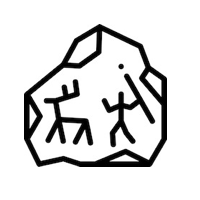

<h1 style="border-bottom:0" align="center">Engrave - Write message into the ethereum chain</h1>
<a href="https://tstream.club">

</a>

<a href="https://engrave.on.fleek.co">Website</a>

# What it does?
It's an easy way for you to write text messages into ethereum chain by sending a 0.0ETH transaction to yourself with a data input

## Why?
Well, if you think about the history of humanity. Our ancient greeks __engrave__ on rocks so that after thousands of years we can still learn about their life.

So, Maybe... (just maybe) the ethereum chain could be the __rocks__ of our generation.

If you want to preserve your quotes, or lyrics you wrote, or just a message to someone in the future, you can use __engrave__ to do that.

Also, I'm learning about web3 so I think it'd be fun to build this

# Build with 
- [Fleek](https://fleek.co/) - Deploy the front-end on IPFS
- [Hardhat](https://hardhat.org/) - for the development of smart contract
- [Ethers](https://docs.ethers.io/) - library to interact with Ethereum blockchain

# Engrave smart contract
This project comes with a smart contract to stores transactions that users send to the chain using Engrave

By adding to this smart contract users can query all message they wrote using their wallet address

Currently this contract is deployed on:
- [Ropsten](https://ropsten.etherscan.io/address/0xf166427615c41206246ff3e2d8332f4890b38068)
- [Kovan]()
- [Rinkeby]()
- [Goerli]()
- Ethereum Mainnet(soon)

## The icon

Icons made by <a href="https://www.freepik.com" title="Freepik">Freepik</a> from <a href="https://www.flaticon.com/" title="Flaticon">www.flaticon.com</a>

